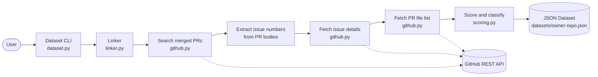

<div align="center">

# IssueScout

**Curate GitHub issues into a versioned dataset for LLM bug-fixing evaluation.**

[](https://github.com/Vick606/issue-scout/actions/workflows/ci.yml)
[](https://www.python.org/downloads/)
[](LICENSE)

</div>

<br>

IssueScout finds issues in a GitHub repository that are good candidates for evaluating whether an LLM can fix real bugs, then writes them to a versioned JSON dataset. A good candidate is a closed issue with a merged pull request that touched test files.

```bash
python -m issue_scout.dataset pallets click 15
```

```
7 records written to datasets/pallets-click.json
```

<br>

## What it does

- Searches for merged PRs that are linked to issues via close keywords (`fixes #123`, `closes #456`).
- Extracts the linked issue number from each PR body.
- Fetches the PR's file list and classifies each file as test, documentation, or source.
- Scores each issue on a 0 to 10 scale based on how well it fits LLM bug-fix evaluation.
- Writes a versioned JSON dataset with all features and scores.

<br>

## Quick start

**Requirements:** Python 3.10+.

```bash
git clone https://github.com/Vick606/issue-scout.git
cd issue-scout
pip install -e ".[dev]"
```

**Optional:** set a GitHub token to raise the API rate limit from 60 to 5000 requests per hour.

```bash
export GH_TOKEN=your_token_here
```

**Run:**

```bash
python -m issue_scout.dataset <owner> <repo> [limit]
```

**Example:**

```bash
python -m issue_scout.dataset pallets click 15
```

<br>

## Suitability score

Each issue is scored from 0 to 10 based on its linked PR's diff:

| Signal | Weight | Reason |
|---|---|---|
| Base | +5.0 | Neutral starting point |
| Test file changed | +2.0 each | Tests let us verify a candidate fix |
| Files changed | -0.1 each | Large diffs are hard to evaluate |
| Lines changed | -0.01 each | Same reason |
| Docs-only change | -3.0 | No code to test |

The formula is a deliberate design choice, not a black box. It rewards issues whose fixes touched tests and penalizes large refactors and documentation-only changes.

<br>

## Example output

From `pallets/click`, top 5 by score:

```
score= 7.92  #2869  tests=2 files=5
    Support pathlib.Path in edit filename

score= 7.76  #3822  tests=2 files=4
    `click.Path` should be generic on `path_type`

score= 6.27  #3571  tests=1 files=3
    `click.progressbar` doesn't show full completion when using `show_pos=True`

score= 5.92  #3740  tests=1 files=3
    [Bug] On Windows, get_pager_file returns a typing.BinaryIO object

score= 4.48  #2582  tests=0 files=2
    The `edit` utility does not work on Windows for Visual Studio Code
```

<br>

## Dataset schema

```json
{
  "schema_version": "1.0",
  "timestamp": "2026-09-20T10:45:28+00:00",
  "source": {
    "owner": "pallets",
    "repo": "click",
    "url": "https://github.com/pallets/click"
  },
  "record_count": 10,
  "records": [
    {
      "issue_number": 2869,
      "issue_title": "Support pathlib.Path in edit filename",
      "linked_pr_number": 3781,
      "linked_pr_title": "Add support of `pathlib.Path` to `edit`",
      "merged_at": "2026-08-20T02:50:20Z",
      "issue_closed_at": "2026-08-20T02:50:21Z",
      "features": {
        "files_changed": 5,
        "test_files_changed": 2,
        "doc_files_changed": 1,
        "source_files_changed": 2,
        "additions": 47,
        "deletions": 11,
        "total_lines_changed": 58,
        "test_file_names": ["tests/test_termui.py"]
      },
      "suitability_score": 7.92
    }
  ]
}
```

<br>

## Architecture



Each stage is a separate module with its own unit tests. The dataset CLI only orchestrates.

<br>

## Tests

```bash
pytest -v
```

23 tests, all passing. The suite runs in under a second with no network calls. HTTP responses are mocked with the `responses` library.

<br>

## Limitations

- **Heuristic link detection.** Close keywords in PR bodies are the standard convention, but some projects use other linking methods.
- **Scoring is opinionated.** The formula rewards test coverage and small diffs. Adjust the weights in `scoring.py` if you have different priorities.
- **Python-oriented file classification.** Test path detection targets Python conventions. Other languages need additional markers.
- **Single-repo runs.** No batch mode across multiple repositories yet.
- **No patch evaluation.** This tool curates issues. It does not apply or score candidate fixes.

<br>

## Roadmap

- [x] **v0.1** — Core pipeline: search, extract, enrich, score, write dataset
- [ ] **v0.2** — Batch runs across multiple repos from a manifest file
- [ ] **v0.3** — Integration with RepoProbe to evaluate candidate patches on high-scoring issues
- [ ] **v0.4** — Optional LLM scoring pass to refine heuristics

<br>

## License

MIT. See [LICENSE](LICENSE).

<br>

<div align="center">

<sub>Built with ❤️ and ☕ by <a href="https://github.com/Vick606">Victor</a> · © 2026</sub>

</div>